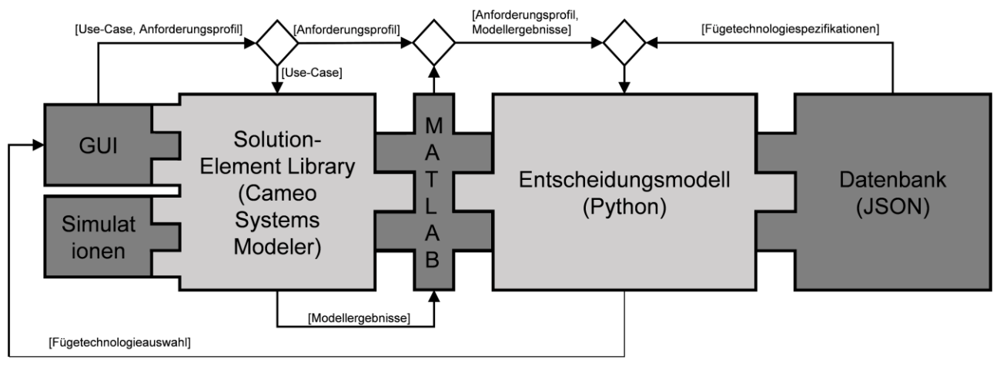

# Background

Model-based systems engineering is a methodology focusing on domain models as the primary information source rather than documents. Models of joining technologies can be used to simulate a joining process as a subdomain inside a larger construction. The repository is representing a decision-tool for comparing joining technologies modeled inside the software Cameo Systems Modeler, where each joining technology is modeled with the systems engineering language SysML.

The approach is a multicriteria model-based decision comparing each model with specific conditions from the user. The code is based on my academic research in RWTH Aachen University and can be transferred to other SysML decision approaches. 

# Documentation

The decision-tool is written in MATLAB and Python, which is called by Cameo Systems Modeler. The Matlab file can be used as a constraint block in MATLAB and has ports for joining technology models. A .csm file can be given upon request along with the research manuscript describing the approach in detail.

# Contact

Jonas Werheid, jonas.werheid@rwth-aachen.de.
